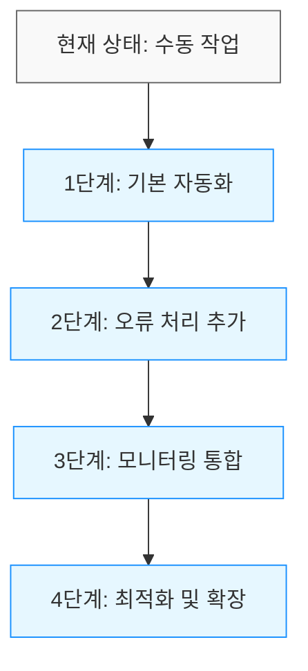
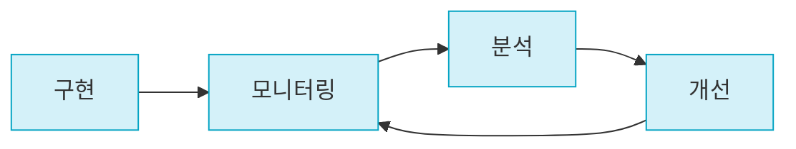

# Day 21: 작업 자동화 구현 패턴과 모범 사례

## 효과적인 작업 자동화 패턴

작업 자동화는 단순히 도구를 선택하고 설정하는 것 이상의 의미를 가집니다. 효과적인 자동화를 위해서는 적절한 패턴과 접근 방식을 적용해야 합니다. 이 문서에서는 작업 자동화 구현에 활용할 수 있는 주요 패턴과 모범 사례를 살펴보겠습니다.

## 주요 자동화 패턴

### 1. 이벤트 기반 자동화 패턴 (Event-driven Automation)

이벤트가 발생할 때 작업을 트리거하는 패턴으로, 필요한 시점에만 작업이 실행되어 효율적입니다.

#### 특징:

- **느슨한 결합**: 이벤트 생성자와 소비자 간의 느슨한 결합
- **실시간 반응**: 이벤트 발생 즉시 작업 실행
- **확장성**: 새로운 이벤트 유형과 처리기 쉽게 추가 가능

#### 구현 예시:

```javascript
// Supabase 데이터베이스 변경에 반응하는 Lambda 함수
// AWS Lambda 함수 (index.js)
exports.handler = async (event) => {
  // Supabase Webhook에서 전달된 이벤트 데이터
  const payload = JSON.parse(event.body);
  
  // 이벤트 유형에 따른 처리
  switch (payload.type) {
    case 'INSERT':
      await processNewRecord(payload.record);
      break;
    case 'UPDATE':
      await processUpdatedRecord(payload.old_record, payload.record);
      break;
    case 'DELETE':
      await processDeletedRecord(payload.old_record);
      break;
  }
  
  return {
    statusCode: 200,
    body: JSON.stringify({ message: 'Event processed successfully' })
  };
};
```

#### 적용 사례:

- 사용자 등록 시 환영 이메일 발송
- 새 콘텐츠 게시 시 소셜 미디어 공유
- 결제 완료 시 인보이스 생성
- 재고 부족 시 자동 발주

### 2. 파이프라인 패턴 (Pipeline Pattern)

여러 단계의 처리 과정을 순차적으로 연결하여 복잡한 워크플로우를 자동화하는 패턴입니다.

#### 특징:

- **단계별 처리**: 복잡한 작업을 작은 단계로 분할
- **단계 간 결합**: 한 단계의 출력이 다음 단계의 입력으로 연결
- **병렬 처리 가능**: 독립적인 단계는 병렬로 실행 가능
- **재사용성**: 개별 단계 재사용 가능

#### 구현 예시:

```yaml
# GitHub Actions 워크플로우 (.github/workflows/content-pipeline.yml)
name: Content Processing Pipeline

on:
  schedule:
    - cron: '0 1 * * *'  # 매일 01:00 UTC에 실행

jobs:
  fetch-content:
    runs-on: ubuntu-latest
    steps:
      - name: Checkout repository
        uses: actions/checkout@v3
      
      - name: Fetch content from API
        run: node scripts/fetch-content.js
        
      - name: Upload content for processing
        uses: actions/upload-artifact@v3
        with:
          name: raw-content
          path: tmp/raw-content.json
          
  process-content:
    needs: fetch-content
    runs-on: ubuntu-latest
    steps:
      - name: Checkout repository
        uses: actions/checkout@v3
        
      - name: Download raw content
        uses: actions/download-artifact@v3
        with:
          name: raw-content
          path: tmp
          
      - name: Process content
        run: node scripts/process-content.js
        
      - name: Upload processed content
        uses: actions/upload-artifact@v3
        with:
          name: processed-content
          path: tmp/processed-content.json
          
  publish-content:
    needs: process-content
    runs-on: ubuntu-latest
    steps:
      - name: Checkout repository
        uses: actions/checkout@v3
        
      - name: Download processed content
        uses: actions/download-artifact@v3
        with:
          name: processed-content
          path: tmp
          
      - name: Publish content to database
        run: node scripts/publish-content.js
        env:
          SUPABASE_URL: ${{ secrets.SUPABASE_URL }}
          SUPABASE_KEY: ${{ secrets.SUPABASE_SERVICE_KEY }}
```

#### 적용 사례:

- 콘텐츠 생성-검증-배포 파이프라인
- 데이터 수집-변환-분석-보고 파이프라인
- 코드 빌드-테스트-배포 파이프라인
- 이미지 업로드-처리-최적화-저장 파이프라인

### 3. 상태 기반 자동화 패턴 (State-based Automation)

시스템 상태나 조건을 모니터링하고, 특정 상태에 도달했을 때 작업을 실행하는 패턴입니다.

#### 특징:

- **상태 모니터링**: 시스템 상태 지속적 모니터링
- **임계값 기반 트리거**: 특정 임계값 도달 시 작업 실행
- **선제적 대응**: 문제 발생 전 선제적 조치 가능

#### 구현 예시:

```javascript
// app/api/cron/monitor-system.js
import { createClient } from '@supabase/supabase-js';

// 보안 검증
const CRON_SECRET = process.env.CRON_SECRET;

// Supabase 클라이언트 초기화
const supabase = createClient(
  process.env.NEXT_PUBLIC_SUPABASE_URL,
  process.env.SUPABASE_SERVICE_ROLE_KEY
);

export default async function handler(req, res) {
  // 보안 토큰 검증
  if (req.headers.authorization !== `Bearer ${CRON_SECRET}`) {
    return res.status(401).json({ error: 'Unauthorized' });
  }
  
  try {
    // 시스템 상태 확인
    const { data: storageStats, error: storageError } = await supabase
      .rpc('get_storage_stats');
    
    if (storageError) throw storageError;
    
    // 스토리지 사용량 임계값 체크 (80% 이상)
    if (storageStats.usage_percentage > 80) {
      // 경고 알림 발송
      await sendAlert({
        type: 'warning',
        subject: 'Storage usage high',
        message: `Storage usage is at ${storageStats.usage_percentage}%`,
        recipients: ['admin@example.com']
      });
      
      // 오래된 파일 정리 (90% 이상일 경우)
      if (storageStats.usage_percentage > 90) {
        await supabase.rpc('cleanup_old_files', { days_old: 30 });
      }
    }
    
    // 사용자 활동 모니터링
    const { data: userStats, error: userError } = await supabase
      .rpc('get_user_activity_stats');
    
    if (userError) throw userError;
    
    // 비정상 활동 체크 (급격한 증가)
    if (userStats.activity_change_percentage > 200) {
      // 보안 알림 발송
      await sendAlert({
        type: 'security',
        subject: 'Unusual user activity detected',
        message: `User activity increased by ${userStats.activity_change_percentage}%`,
        recipients: ['security@example.com']
      });
    }
    
    res.status(200).json({ status: 'success', message: 'System monitored successfully' });
  } catch (error) {
    console.error('System monitoring failed:', error);
    res.status(500).json({ error: 'Internal server error', details: error.message });
  }
}

async function sendAlert({ type, subject, message, recipients }) {
  // 알림 발송 로직
  // (이메일, 슬랙 등)
}
```

#### 적용 사례:

- 서버 부하에 따른 자동 스케일링
- 디스크 공간 부족 시 자동 정리
- 비정상 로그인 시도 감지 및 차단
- 서비스 응답 시간 저하 시 알림

### 4. 시간 기반 배치 패턴 (Time-based Batch Pattern)

정해진 시간에 여러 작업을 일괄 처리하는 패턴으로, 리소스를 효율적으로 사용할 수 있습니다.

#### 특징:

- **예측 가능한 실행**: 정해진 일정에 따라 작업 실행
- **자원 사용 최적화**: 자원 사용량이 적은 시간대에 작업 실행
- **일괄 처리 효율성**: 여러 작업을 함께 처리하여 리소스 효율 향상

#### 구현 예시:

```sql
-- Supabase SQL 함수 (night_batch_processing.sql)
CREATE OR REPLACE FUNCTION public.run_night_batch_processing()
RETURNS void AS $$
BEGIN
  -- 1. 활성 사용자 통계 업데이트
  INSERT INTO analytics.user_stats (date, active_users, new_users, returning_users)
  SELECT
    CURRENT_DATE - INTERVAL '1 day',
    COUNT(DISTINCT id) FILTER (WHERE last_activity_at >= CURRENT_DATE - INTERVAL '1 day'),
    COUNT(DISTINCT id) FILTER (WHERE created_at >= CURRENT_DATE - INTERVAL '1 day'),
    COUNT(DISTINCT id) FILTER (WHERE created_at < CURRENT_DATE - INTERVAL '1 day' AND last_activity_at >= CURRENT_DATE - INTERVAL '1 day')
  FROM public.users;

  -- 2. 만료된 세션 정리
  DELETE FROM auth.sessions
  WHERE expires_at < NOW();

  -- 3. 오래된 알림 아카이브
  INSERT INTO archive.notifications (id, user_id, message, created_at, read_at)
  SELECT id, user_id, message, created_at, read_at
  FROM public.notifications
  WHERE created_at < NOW() - INTERVAL '30 days';

  DELETE FROM public.notifications
  WHERE created_at < NOW() - INTERVAL '30 days';

  -- 4. 시스템 상태 보고서 생성
  INSERT INTO reports.system_health (date, user_count, content_count, avg_response_time)
  SELECT
    CURRENT_DATE,
    (SELECT COUNT(*) FROM public.users),
    (SELECT COUNT(*) FROM public.contents),
    (SELECT AVG(response_time) FROM logs.api_requests WHERE created_at >= CURRENT_DATE - INTERVAL '1 day');
END;
$$ LANGUAGE plpgsql;

-- 매일 새벽 3시에 실행
SELECT cron.schedule(
  'night-batch-processing',
  '0 3 * * *',
  'SELECT public.run_night_batch_processing()'
);
```

#### 적용 사례:

- 야간 데이터베이스 정리 및 최적화
- 일일 통계 계산 및 보고서 생성
- 사용량이 적은 시간대의 대규모 데이터 마이그레이션
- 정기적인 백업 및 아카이빙

## 자동화 모범 사례

효과적인 작업 자동화를 위한 모범 사례를 살펴보겠습니다.

### 1. 설계 및 계획 단계

#### 명확한 목표 설정

자동화하려는 작업의 목표와 기대 효과를 명확히 정의합니다.

```markdown
# 작업 자동화 정의서

## 작업명: 일일 콘텐츠 추천 생성

## 목표
- 사용자별 맞춤형 콘텐츠 추천 생성
- 사용자 참여도 10% 향상
- 운영팀의 수동 작업 시간 주 5시간 절감

## 자동화 범위
- 사용자 활동 데이터 수집 및 분석
- 추천 알고리즘 실행
- 사용자별 추천 목록 생성 및 저장
- 메일/푸시 알림 발송

## 제외 범위
- 콘텐츠 품질 평가 (수동 검토 필요)
- 추천 알고리즘 개선 (별도 분석 과정)

## 성공 지표
- 추천 콘텐츠 클릭률 (목표: 25% 이상)
- 사용자 체류 시간 (목표: 평균 2분 증가)
- 작업 실행 성공률 (목표: 99.9%)
```

#### 단계적 접근 방식

복잡한 작업은 작은 단계로 나누어 점진적으로 자동화합니다.



#### 재사용성 고려

여러 프로젝트에서 재사용할 수 있는 모듈식 설계를 채택합니다.

```javascript
// utils/automation/notifications.js
// 재사용 가능한 알림 모듈

export async function sendNotification({
  type,
  recipients,
  subject,
  message,
  template,
  data
}) {
  // 알림 유형에 따른 처리
  switch (type) {
    case 'email':
      return await sendEmail({ recipients, subject, message, template, data });
    case 'push':
      return await sendPushNotification({ recipients, title: subject, body: message, data });
    case 'slack':
      return await sendSlackMessage({ channel: recipients, text: message, data });
    case 'database':
      return await storeNotification({ userIds: recipients, subject, message, data });
    default:
      throw new Error(`Unsupported notification type: ${type}`);
  }
}

// 개별 함수들 구현
// ...
```

### 2. 구현 단계

#### 멱등성 보장

동일한 작업을 여러 번 실행해도 동일한 결과가 나오도록 설계합니다.

```javascript
// 멱등성을 보장하는 결제 처리 함수
async function processPayment(orderId) {
  // 중복 처리 방지
  const { data: existingPayment } = await supabase
    .from('payments')
    .select('id, status')
    .eq('order_id', orderId)
    .single();
  
  // 이미 성공적으로 처리된 결제가 있다면 재처리하지 않음
  if (existingPayment && existingPayment.status === 'completed') {
    console.log(`Payment for order ${orderId} already processed`);
    return { id: existingPayment.id, status: 'completed', isNew: false };
  }
  
  // 결제 처리 로직
  const paymentResult = await paymentGateway.processOrder(orderId);
  
  // 결과 저장 (존재하면 업데이트, 없으면 생성)
  const { data: payment } = await supabase
    .from('payments')
    .upsert({
      order_id: orderId,
      amount: paymentResult.amount,
      status: paymentResult.success ? 'completed' : 'failed',
      processed_at: new Date().toISOString(),
      gateway_reference: paymentResult.reference
    })
    .select()
    .single();
  
  return { ...payment, isNew: !existingPayment };
}
```

#### 오류 처리 및 재시도 메커니즘

실패 시 적절히 처리하고 필요에 따라 재시도하는 메커니즘을 구현합니다.

```typescript
// utils/retry.ts
interface RetryOptions {
  maxAttempts: number;
  initialDelay: number; // ms
  backoffFactor: number;
  retryableErrors?: Array<string | RegExp>;
}

export async function withRetry<T>(
  fn: () => Promise<T>,
  options: Partial<RetryOptions> = {}
): Promise<T> {
  const {
    maxAttempts = 3,
    initialDelay = 1000,
    backoffFactor = 2,
    retryableErrors = []
  } = options;

  let lastError: Error;
  
  for (let attempt = 1; attempt <= maxAttempts; attempt++) {
    try {
      return await fn();
    } catch (error) {
      lastError = error;
      
      // 재시도 가능한 오류인지 확인
      const isRetryable = retryableErrors.length === 0 || 
        retryableErrors.some(pattern => {
          if (typeof pattern === 'string') {
            return error.message.includes(pattern);
          }
          return pattern.test(error.message);
        });
      
      // 마지막 시도이거나 재시도 불가능한 오류면 중단
      if (attempt === maxAttempts || !isRetryable) {
        break;
      }
      
      // 지수 백오프 적용
      const delay = initialDelay * Math.pow(backoffFactor, attempt - 1);
      console.log(`Attempt ${attempt} failed, retrying in ${delay}ms...`);
      await new Promise(resolve => setTimeout(resolve, delay));
    }
  }
  
  throw lastError;
}

// 사용 예시
async function fetchExternalData() {
  return withRetry(
    () => axios.get('https://api.example.com/data'),
    {
      maxAttempts: 5,
      retryableErrors: [
        'ETIMEDOUT',
        'ECONNRESET',
        'ECONNREFUSED',
        'ENOTFOUND',
        /5\d\d/  // 500번대 오류
      ]
    }
  );
}
```

#### 로깅 및 모니터링

작업 실행 상황을 추적하고 문제 발생 시 빠르게 대응할 수 있도록 로깅과 모니터링을 설정합니다.

```typescript
// utils/logging.ts
enum LogLevel {
  DEBUG = 'debug',
  INFO = 'info',
  WARN = 'warn',
  ERROR = 'error'
}

interface LogContext {
  jobId?: string;
  component?: string;
  userId?: string;
  [key: string]: any;
}

export class AutomationLogger {
  constructor(
    private component: string,
    private supabaseClient: any,
    private shouldPersist: boolean = true
  ) {}
  
  async log(level: LogLevel, message: string, context: LogContext = {}) {
    const timestamp = new Date();
    const logEntry = {
      timestamp: timestamp.toISOString(),
      level,
      component: context.component || this.component,
      message,
      context: { ...context }
    };
    
    // 콘솔 출력
    console[level](
      `[${timestamp.toISOString()}] [${level.toUpperCase()}] [${logEntry.component}] ${message}`,
      context
    );
    
    // 데이터베이스에 저장
    if (this.shouldPersist) {
      try {
        await this.supabaseClient
          .from('automation_logs')
          .insert({
            level,
            component: logEntry.component,
            message,
            context: context,
            created_at: timestamp.toISOString()
          });
      } catch (error) {
        console.error('Failed to persist log:', error);
      }
    }
    
    return logEntry;
  }
  
  debug(message: string, context?: LogContext) {
    return this.log(LogLevel.DEBUG, message, context);
  }
  
  info(message: string, context?: LogContext) {
    return this.log(LogLevel.INFO, message, context);
  }
  
  warn(message: string, context?: LogContext) {
    return this.log(LogLevel.WARN, message, context);
  }
  
  error(message: string, context?: LogContext) {
    return this.log(LogLevel.ERROR, message, context);
  }
}
```

### 3. 보안 고려사항

#### 최소 권한 원칙

자동화 작업에는 필요한 최소한의 권한만 부여합니다.

```javascript
// AWS IAM 정책 예시 (JSON)
{
  "Version": "2012-10-17",
  "Statement": [
    {
      "Effect": "Allow",
      "Action": [
        "s3:GetObject",
        "s3:PutObject"
      ],
      "Resource": "arn:aws:s3:::example-bucket/backups/*"
    },
    {
      "Effect": "Allow",
      "Action": [
        "sqs:ReceiveMessage",
        "sqs:DeleteMessage"
      ],
      "Resource": "arn:aws:sqs:region:account-id:backup-queue"
    }
  ]
}
```

#### 비밀 정보 관리

API 키, 비밀번호 등 민감한 정보는 환경 변수나 비밀 저장소를 통해 안전하게 관리합니다.

```yaml
# GitHub Actions 비밀 사용 예시
name: Deploy with Secrets

on:
  push:
    branches: [ main ]

jobs:
  deploy:
    runs-on: ubuntu-latest
    steps:
      - uses: actions/checkout@v3
      
      - name: Deploy to production
        run: |
          echo "Deploying to production..."
          ./deploy.sh --api-key ${{ secrets.API_KEY }} --env production
        env:
          DATABASE_URL: ${{ secrets.DATABASE_URL }}
          JWT_SECRET: ${{ secrets.JWT_SECRET }}
```

### 4. 테스트 및 검증

#### 단위 테스트

자동화 작업의 개별 구성 요소를 테스트합니다.

```javascript
// 단위 테스트 예시 (Jest)
import { processUserData } from '../src/userProcessor';

describe('User Data Processor', () => {
  test('should correctly process valid user data', async () => {
    const mockUser = {
      id: '123',
      name: 'John Doe',
      email: 'john@example.com',
      created_at: '2023-01-01T00:00:00Z'
    };
    
    const result = await processUserData(mockUser);
    
    expect(result).toEqual({
      userId: '123',
      displayName: 'John Doe',
      contactInfo: { email: 'john@example.com' },
      accountAge: expect.any(Number),
      processed: true
    });
  });
  
  test('should handle missing email', async () => {
    const mockUser = {
      id: '123',
      name: 'John Doe',
      created_at: '2023-01-01T00:00:00Z'
    };
    
    const result = await processUserData(mockUser);
    
    expect(result).toEqual({
      userId: '123',
      displayName: 'John Doe',
      contactInfo: { email: 'unknown' },
      accountAge: expect.any(Number),
      processed: true
    });
  });
  
  test('should throw error for invalid user data', async () => {
    const mockUser = null;
    
    await expect(processUserData(mockUser)).rejects.toThrow('Invalid user data');
  });
});
```

#### 통합 테스트

자동화 작업의 전체 흐름을 테스트하여 모든 구성 요소가 함께 잘 작동하는지 확인합니다.

```javascript
// 통합 테스트 예시 (Jest)
import { setupTestDatabase, cleanupTestDatabase } from '../test/helpers';
import { startDataSyncJob } from '../src/jobs/dataSync';
import { supabase } from '../src/lib/supabase';

describe('Data Sync Job Integration Test', () => {
  beforeAll(async () => {
    await setupTestDatabase();
  });
  
  afterAll(async () => {
    await cleanupTestDatabase();
  });
  
  test('should sync data from external API to database', async () => {
    // 초기 상태 확인
    const { count: initialCount } = await supabase
      .from('products')
      .select('*', { count: 'exact', head: true });
    
    // 데이터 동기화 작업 실행
    const result = await startDataSyncJob();
    
    // 결과 검증
    expect(result.success).toBe(true);
    expect(result.syncedItems).toBeGreaterThan(0);
    
    // 데이터베이스 상태 확인
    const { count: finalCount } = await supabase
      .from('products')
      .select('*', { count: 'exact', head: true });
    
    expect(finalCount).toBeGreaterThan(initialCount);
    
    // 특정 데이터 검증
    const { data: sampleProduct } = await supabase
      .from('products')
      .select('*')
      .eq('external_id', result.sampleIds[0])
      .single();
    
    expect(sampleProduct).toHaveProperty('name');
    expect(sampleProduct).toHaveProperty('price');
    expect(sampleProduct).toHaveProperty('synced_at');
  });
});
```

### 5. 운영 및 유지보수

#### 점진적 개선

자동화 작업의 성능을 지속적으로 모니터링하고 개선합니다.



#### 문서화

자동화 작업의 목적, 구현 방법, 트러블슈팅 가이드 등을 상세히 문서화합니다.

```markdown
# 일일 데이터 백업 자동화 문서

## 개요
매일 자정에 IdeasGPT 서비스의 핵심 데이터를 백업하여 S3 버킷에 저장하는 작업입니다.

## 구현 방식
- **도구**: AWS Lambda + EventBridge
- **언어**: Node.js 18.x
- **주기**: 매일 00:00 UTC

## 실행 흐름
1. EventBridge 규칙에 의해 Lambda 함수 트리거
2. Supabase에서 백업할 테이블 목록 조회
3. 각 테이블 데이터를 JSON 형식으로 추출
4. 데이터 압축 및 암호화
5. S3 버킷에 날짜별 폴더로 저장
6. 백업 결과 로깅 및 알림

## 설정 방법
1. Lambda 함수 생성: `ideasgpt-daily-backup`
2. 환경 변수 설정:
   - `SUPABASE_URL`: Supabase 프로젝트 URL
   - `SUPABASE_SERVICE_KEY`: 서비스 롤 키
   - `BACKUP_BUCKET`: S3 버킷 이름
   - `TABLES_TO_BACKUP`: 백업할 테이블 목록 (쉼표로 구분)
3. IAM 역할 구성: S3 접근 권한 부여
4. EventBridge 규칙 생성: `cron(0 0 * * ? *)`

## 모니터링
- CloudWatch 로그: `/aws/lambda/ideasgpt-daily-backup`
- 알림: 백업 실패 시 관리자 이메일로 알림
- 대시보드: Supabase 내 백업 상태 확인 페이지

## 문제 해결
- **오류: "Database connection failed"**
  - 원인: Supabase 인증 정보 오류 또는 네트워크 문제
  - 해결: 환경 변수 확인 및 VPC 설정 검토
  
- **오류: "S3 upload failed"**
  - 원인: S3 권한 부족 또는 버킷 이름 오류
  - 해결: IAM 역할 정책 확인 및 버킷 존재 여부 확인

## 담당자
- 개발: 홍길동 (hong@example.com)
- 운영: 김철수 (kim@example.com)
```

## 핵심 원칙 요약

효과적인 작업 자동화 구현을 위한 핵심 원칙을 요약해 보겠습니다.

1. **단일 책임 원칙**: 각 자동화 작업은 하나의 명확한 목적을 가져야 합니다.
2. **테스트 가능성**: 자동화 작업은 단위 테스트와 통합 테스트가 가능하도록 설계해야 합니다.
3. **실패에 대한 대비**: 모든 자동화 작업은 실패 가능성을 고려하고, 적절한 오류 처리 및 복구 메커니즘을 구현해야 합니다.
4. **모니터링 및 알림**: 자동화 작업의 상태와 결과를 모니터링하고, 문제 발생 시 즉시 알림을 보내도록 설정해야 합니다.
5. **점진적 개선**: 자동화는 한 번에 완벽하게 구현하기보다 지속적으로 개선해 나가는 것이 효과적입니다.
6. **비즈니스 가치 중심**: 자동화의 목적은 기술적 우아함보다 비즈니스 가치 창출에 있어야 합니다.

## 결론

작업 자동화는 단순히 기술적 도구의 구현을 넘어, 효율적인 패턴과 모범 사례를 적용하는 것이 중요합니다. 이 문서에서 소개한 패턴과 모범 사례를 활용하여 안정적이고 효율적인 자동화 시스템을 구축하시기 바랍니다.

효과적인 작업 자동화는 개발자의 생산성을 향상시키고, 인적 오류를 줄이며, 서비스의 안정성과 신뢰성을 높이는 데 큰 도움이 됩니다. 작업의 특성과 요구사항에 맞는 패턴을 선택하고, 모범 사례를 따라 구현함으로써 장기적으로 지속 가능한 자동화 시스템을 구축할 수 있습니다.