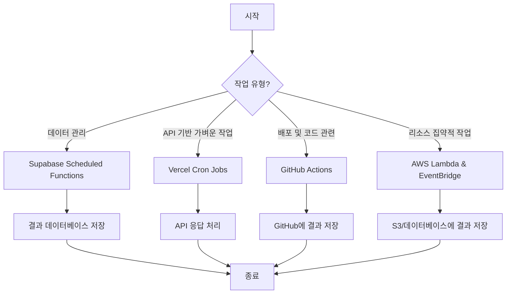
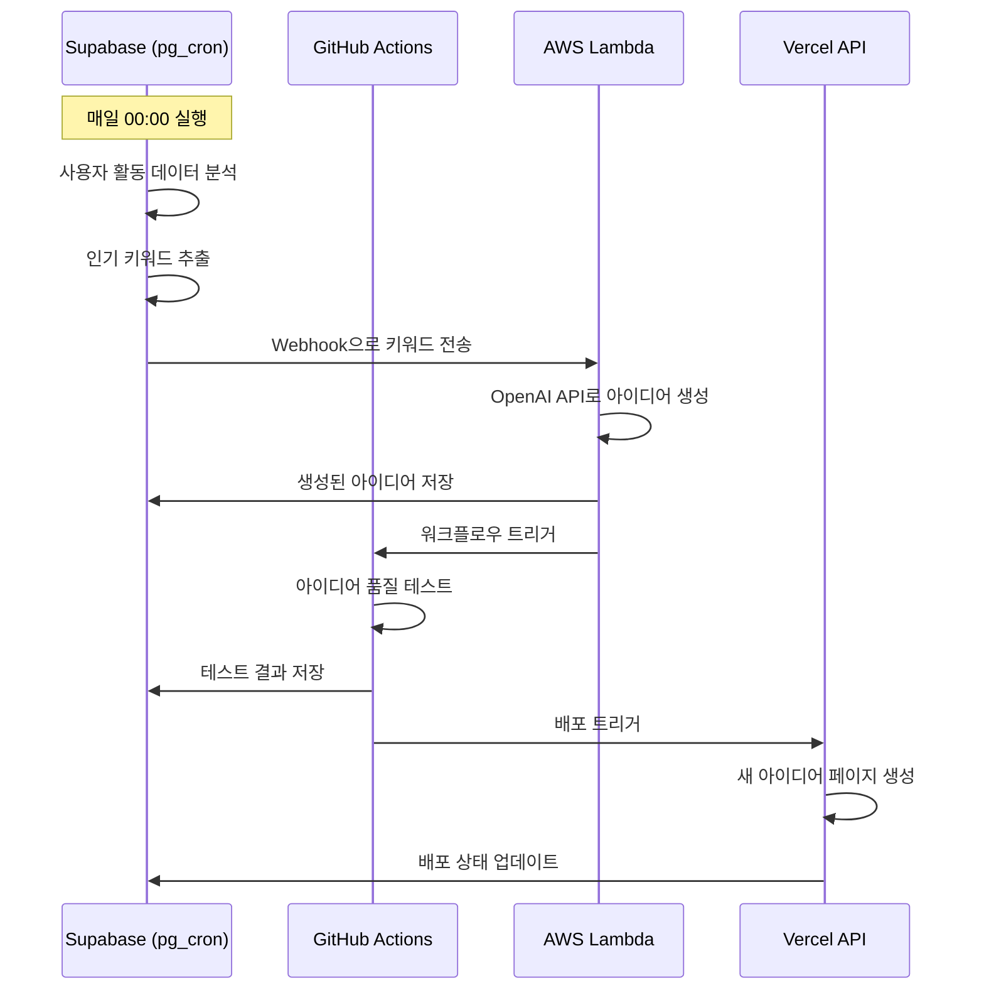

# Day 21 과제 5 - 여러 작업 자동화 도구의 비교 분석 및 활용 전략

## 목표

Day 21의 이전 과제들에서 학습한 Supabase Scheduled Functions, Vercel Cron Jobs, GitHub Actions, AWS Lambda와 EventBridge 등 다양한 작업 자동화 도구들을 비교 분석하고, IdeasGPT 서비스를 위한 최적의 자동화 전략을 수립합니다.

## 작업 자동화 도구 비교 분석

지금까지 학습한 작업 자동화 도구들의 특징, 장단점, 적합한 사용 사례를 비교 분석해 보겠습니다.

### 1. Supabase Scheduled Functions (pg_cron)

**특징:**
- PostgreSQL 내부에서 직접 실행되는 데이터베이스 레벨의 스케줄링
- SQL 함수를 통해 구현
- 데이터베이스와 관련된 작업에 최적화

**장점:**
- 네트워크 오버헤드 없음
- 트랜잭션 내에서 작업 실행 가능
- 대량의 데이터 처리에 효율적
- 데이터베이스 직접 접근으로 높은 보안성

**단점:**
- 데이터베이스 외부 리소스 접근 제한적
- 복잡한 비즈니스 로직 구현이 어려울 수 있음
- 실행 환경 확장 어려움
- 리소스 집약적인 작업 시 DB 성능에 영향 줄 수 있음

**적합한 사용 사례:**
- 데이터 정리 및 최적화
- 통계 데이터 집계
- 데이터베이스 유지 보수
- 간단한 데이터 변환 및 업데이트

### 2. Vercel Cron Jobs

**특징:**
- Next.js 애플리케이션과 통합된 서버리스 스케줄링
- API 라우트를 통해 구현
- 서버리스 환경에 최적화

**장점:**
- 배포 환경과 통합되어 관리 용이
- 별도 인프라 구축 필요 없음
- Next.js 애플리케이션의 코드 재사용
- 간단한 설정으로 빠른 구현

**단점:**
- 실행 시간 제한 (최대 60초)
- Vercel 플랫폼에 종속
- 확장성 제한
- 리소스 집약적 작업에 부적합

**적합한 사용 사례:**
- 경량 API 호출
- 소규모 데이터 동기화
- 간단한 알림 서비스
- 주기적인 캐시 갱신

### 3. GitHub Actions

**특징:**
- 코드 저장소와 통합된 CI/CD 및 워크플로우 자동화
- YAML 파일로 워크플로우 정의
- 다양한 이벤트 트리거 지원

**장점:**
- 코드와 워크플로우의 버전 관리 통합
- 광범위한 커뮤니티 액션 생태계
- 다양한 환경 및 런타임 지원
- 복잡한 파이프라인 구성 가능

**단점:**
- 실행 시간 제한 있음 (최대 6시간)
- 컴퓨팅 리소스 제한
- GitHub 플랫폼에 종속
- 민감한 비즈니스 로직에 적합하지 않을 수 있음

**적합한 사용 사례:**
- 코드 배포 자동화
- 테스트 및 린팅
- 주기적인 데이터 백업
- 보고서 생성 및 배포

### 4. AWS Lambda와 EventBridge

**특징:**
- 서버리스 컴퓨팅 및 이벤트 관리
- 다양한 프로그래밍 언어 지원
- 클라우드 리소스와 통합

**장점:**
- 높은 확장성
- 정교한 스케줄링 및 이벤트 기반 트리거
- 다양한 AWS 서비스와 통합
- 장기 실행 작업 지원 (최대 15분)

**단점:**
- 설정 및 관리 복잡성
- 비용 관리 필요
- 콜드 스타트 지연 가능성
- AWS 플랫폼에 종속

**적합한 사용 사례:**
- 복잡한 데이터 처리
- 리소스 집약적 작업
- 외부 서비스 통합
- 고가용성이 필요한 중요 작업

## IdeasGPT 서비스를 위한 최적의 자동화 전략

IdeasGPT 서비스의 다양한 요구사항을 고려하여 각 도구의 강점을 활용한 최적의 자동화 전략을 수립해 보겠습니다.

### 작업 유형별 최적의 도구 선택

각 작업 유형별로 가장 적합한 자동화 도구를 선택합니다.

1. **데이터 관리 작업**
   - **도구 선택**: Supabase Scheduled Functions
   - **적용 작업**:
     - 아이디어 랭킹 자동 업데이트
     - 미사용 데이터 정리
     - 통계 데이터 집계
   - **선택 이유**: 데이터베이스와 직접 상호작용하는 작업으로, 트랜잭션 내에서 효율적으로 실행 가능하며 네트워크 오버헤드가 없음

2. **API 기반 가벼운 작업**
   - **도구 선택**: Vercel Cron Jobs
   - **적용 작업**:
     - 정기적인 API 상태 확인
     - 캐시 갱신
     - 일일 사용자 활동 요약 발송
   - **선택 이유**: Next.js 애플리케이션과 통합되어 있고, 기존 API 라우트를 재활용하여 간단한 작업을 효율적으로 수행 가능

3. **배포 및 코드 관련 작업**
   - **도구 선택**: GitHub Actions
   - **적용 작업**:
     - 정기 배포 및 테스트
     - 데이터베이스 백업
     - 월간 사용량 보고서 생성
   - **선택 이유**: 코드 저장소와 밀접하게 통합되어 있어 코드 변경과 함께 버전 관리되며, 다양한 커뮤니티 액션을 활용할 수 있음

4. **복잡하고 리소스 집약적인 작업**
   - **도구 선택**: AWS Lambda & EventBridge
   - **적용 작업**:
     - AI 아이디어 대량 생성
     - 이미지 처리 및 최적화
     - 대용량 데이터 분석
   - **선택 이유**: 높은 확장성과 컴퓨팅 리소스를 제공하며, 장시간 실행되는 복잡한 처리 작업에 적합

### 하이브리드 접근 방식 설계

여러 도구를 조합한 하이브리드 접근 방식을 통해 각 도구의 장점을 극대화합니다.



### 작업 간 통신 및 조정 전략

다양한 도구를 사용할 때 작업 간 통신 및 조정이 중요합니다.

1. **중앙 집중식 로깅**
   - 모든 자동화 작업의 로그를 Supabase의 `cron_job_logs` 테이블에 중앙 집중화
   - 각 도구별 작업은 실행 결과를 로그 테이블에 저장하여 통합 모니터링

2. **이벤트 기반 작업 체인**
   - Supabase의 데이터베이스 변경을 Webhook으로 AWS Lambda에 전달
   - GitHub Actions 완료 후 Vercel API 호출하여 후속 작업 트리거

3. **상태 관리**
   - 작업 상태 및 결과를 Supabase에 저장하여 작업 간 정보 공유
   - 실패한 작업에 대한 재시도 메커니즘 구현

### 구체적인 구현 예시

#### 1. 데이터 분석 및 AI 아이디어 생성 파이프라인

이 파이프라인은 여러 도구를 조합하여 데이터 분석 및 AI 아이디어 생성 자동화를 구현합니다.



#### 2. 멀티 환경 자동화 설정

개발, 스테이징, 프로덕션 환경별로 다른 작업 자동화 설정을 구성합니다.

```json
{
  "environments": {
    "development": {
      "database_maintenance": {
        "tool": "Supabase Scheduled Functions",
        "frequency": "daily",
        "actions": ["clean_test_data", "reset_development_data"]
      },
      "deployments": {
        "tool": "GitHub Actions",
        "frequency": "on push to dev branch",
        "actions": ["run_tests", "deploy_to_dev"]
      }
    },
    "staging": {
      "database_maintenance": {
        "tool": "Supabase Scheduled Functions",
        "frequency": "weekly",
        "actions": ["clean_unused_data", "generate_test_statistics"]
      },
      "deployments": {
        "tool": "GitHub Actions",
        "frequency": "on push to staging branch",
        "actions": ["run_integration_tests", "deploy_to_staging"]
      },
      "monitoring": {
        "tool": "AWS Lambda & EventBridge",
        "frequency": "hourly",
        "actions": ["performance_check", "error_monitoring"]
      }
    },
    "production": {
      "database_maintenance": {
        "tool": "Supabase Scheduled Functions",
        "frequency": "daily",
        "actions": ["update_rankings", "clean_unused_data", "aggregate_statistics"]
      },
      "backups": {
        "tool": "GitHub Actions",
        "frequency": "daily",
        "actions": ["backup_database", "store_in_s3"]
      },
      "ai_generation": {
        "tool": "AWS Lambda & EventBridge",
        "frequency": "twice weekly",
        "actions": ["generate_trending_ideas", "quality_check"]
      },
      "reports": {
        "tool": "GitHub Actions",
        "frequency": "monthly",
        "actions": ["generate_monthly_report", "send_to_admins"]
      },
      "cache_management": {
        "tool": "Vercel Cron Jobs",
        "frequency": "every 4 hours",
        "actions": ["refresh_cache", "update_trending_ideas"]
      }
    }
  }
}
```

## 모니터링 및 유지 관리 전략

여러 작업 자동화 도구를 사용할 때는 통합된 모니터링 및 유지 관리 전략이 중요합니다.

### 1. 통합 대시보드 구현

모든 자동화 작업의 상태를 한눈에 볼 수 있는 통합 대시보드를 구현합니다.

```tsx
// app/admin/automation-dashboard/page.tsx
"use client";

import { useState, useEffect } from "react";
import { Card, CardContent, CardHeader, CardTitle } from "@/components/ui/card";
import { Tabs, TabsContent, TabsList, TabsTrigger } from "@/components/ui/tabs";
import { Badge } from "@/components/ui/badge";
import {
  LineChart,
  BarChart,
  PieChart,
  Line,
  Bar,
  Pie,
  XAxis,
  YAxis,
  Tooltip,
  Legend,
  ResponsiveContainer
} from "recharts";

export default function AutomationDashboardPage() {
  const [jobStats, setJobStats] = useState({
    supabase: { success: 0, error: 0, pending: 0 },
    vercel: { success: 0, error: 0, pending: 0 },
    github: { success: 0, error: 0, pending: 0 },
    aws: { success: 0, error: 0, pending: 0 },
  });
  
  const [recentJobs, setRecentJobs] = useState([]);
  const [dailyStats, setDailyStats] = useState([]);
  const [isLoading, setIsLoading] = useState(true);

  // 대시보드 데이터 가져오기
  useEffect(() => {
    const fetchDashboardData = async () => {
      setIsLoading(true);
      try {
        const response = await fetch("/api/admin/automation-stats");
        if (!response.ok) throw new Error("Failed to fetch stats");
        
        const data = await response.json();
        setJobStats(data.jobStats);
        setRecentJobs(data.recentJobs);
        setDailyStats(data.dailyStats);
      } catch (error) {
        console.error("Error fetching dashboard data:", error);
      } finally {
        setIsLoading(false);
      }
    };

    fetchDashboardData();
    const interval = setInterval(fetchDashboardData, 300000); // 5분마다 갱신
    
    return () => clearInterval(interval);
  }, []);

  // 상태에 따른 배지 스타일
  const statusStyles = {
    success: "bg-green-500",
    error: "bg-red-500",
    pending: "bg-yellow-500",
  };

  // 파이 차트 데이터 변환
  const pieData = Object.entries(jobStats).map(([tool, stats]) => ({
    name: tool,
    success: stats.success,
    error: stats.error,
    pending: stats.pending,
  }));

  return (
    <div className="container mx-auto py-8">
      <h1 className="text-3xl font-bold mb-6">자동화 작업 대시보드</h1>
      
      <div className="grid grid-cols-1 md:grid-cols-2 lg:grid-cols-4 gap-6 mb-8">
        {Object.entries(jobStats).map(([tool, stats]) => (
          <Card key={tool}>
            <CardHeader className="pb-2">
              <CardTitle className="capitalize">{tool} 작업</CardTitle>
            </CardHeader>
            <CardContent>
              <div className="flex justify-between items-center">
                <div>
                  <div className="text-2xl font-bold">{stats.success + stats.error + stats.pending}</div>
                  <div className="text-sm text-muted-foreground">총 작업 수</div>
                </div>
                <div className="flex gap-2">
                  <Badge className={statusStyles.success}>{stats.success}</Badge>
                  <Badge className={statusStyles.error}>{stats.error}</Badge>
                  <Badge className={statusStyles.pending}>{stats.pending}</Badge>
                </div>
              </div>
            </CardContent>
          </Card>
        ))}
      </div>
      
      <Tabs defaultValue="overview" className="w-full">
        <TabsList className="grid w-full grid-cols-4">
          <TabsTrigger value="overview">개요</TabsTrigger>
          <TabsTrigger value="recent">최근 실행</TabsTrigger>
          <TabsTrigger value="trends">추세</TabsTrigger>
          <TabsTrigger value="tools">도구별 분석</TabsTrigger>
        </TabsList>
        
        <TabsContent value="overview">
          <Card>
            <CardHeader>
              <CardTitle>작업 성공/실패 비율</CardTitle>
            </CardHeader>
            <CardContent>
              <div className="h-80">
                <ResponsiveContainer width="100%" height="100%">
                  <PieChart>
                    <Pie
                      data={pieData}
                      dataKey="success"
                      nameKey="name"
                      cx="50%"
                      cy="50%"
                      outerRadius={80}
                      fill="#10b981"
                      label
                    />
                    <Pie
                      data={pieData}
                      dataKey="error"
                      nameKey="name"
                      cx="50%"
                      cy="50%"
                      innerRadius={90}
                      outerRadius={110}
                      fill="#ef4444"
                      label
                    />
                    <Tooltip />
                    <Legend />
                  </PieChart>
                </ResponsiveContainer>
              </div>
            </CardContent>
          </Card>
        </TabsContent>
        
        <TabsContent value="recent">
          <Card>
            <CardHeader>
              <CardTitle>최근 실행된 작업</CardTitle>
            </CardHeader>
            <CardContent>
              {/* 최근 작업 목록 */}
            </CardContent>
          </Card>
        </TabsContent>
        
        <TabsContent value="trends">
          <Card>
            <CardHeader>
              <CardTitle>일별 작업 실행 추세</CardTitle>
            </CardHeader>
            <CardContent>
              <div className="h-80">
                <ResponsiveContainer width="100%" height="100%">
                  <LineChart data={dailyStats}>
                    <XAxis dataKey="date" />
                    <YAxis />
                    <Tooltip />
                    <Legend />
                    <Line type="monotone" dataKey="success" stroke="#10b981" />
                    <Line type="monotone" dataKey="error" stroke="#ef4444" />
                  </LineChart>
                </ResponsiveContainer>
              </div>
            </CardContent>
          </Card>
        </TabsContent>
        
        <TabsContent value="tools">
          <Card>
            <CardHeader>
              <CardTitle>도구별 작업 분석</CardTitle>
            </CardHeader>
            <CardContent>
              {/* 도구별 상세 분석 */}
            </CardContent>
          </Card>
        </TabsContent>
      </Tabs>
    </div>
  );
}
```

### 2. 알림 시스템

자동화 작업의 실패 또는 중요 이벤트를 감지하고 알림을 보내는 시스템을 구현합니다.

```typescript
// utils/notification.ts
import { Resend } from 'resend';
import { Slack } from '@slack/webhook';
import { createClient } from '@supabase/supabase-js';

// 클라이언트 초기화
const resend = new Resend(process.env.RESEND_API_KEY);
const slack = new Slack(process.env.SLACK_WEBHOOK_URL);
const supabase = createClient(
  process.env.NEXT_PUBLIC_SUPABASE_URL!,
  process.env.SUPABASE_SERVICE_ROLE_KEY!
);

// 알림 유형
type NotificationType = 'info' | 'warning' | 'error' | 'success';

// 알림 대상
type NotificationChannel = 'email' | 'slack' | 'database';

// 알림 옵션
interface NotificationOptions {
  title: string;
  message: string;
  type: NotificationType;
  channels: NotificationChannel[];
  recipients?: string[]; // 이메일 수신자
  metadata?: Record<string, any>; // 추가 메타데이터
}

/**
 * 알림 보내기
 */
export async function sendNotification(options: NotificationOptions) {
  const { title, message, type, channels, recipients = [], metadata = {} } = options;
  
  const promises = [];
  
  // 이메일 알림
  if (channels.includes('email') && recipients.length > 0) {
    promises.push(
      resend.emails.send({
        from: 'IdeasGPT Automation <noreply@ideasgpt.com>',
        to: recipients,
        subject: `[${type.toUpperCase()}] ${title}`,
        html: `<div><h2>${title}</h2><p>${message}</p>${
          Object.keys(metadata).length > 0 
            ? `<h3>Additional Information</h3><pre>${JSON.stringify(metadata, null, 2)}</pre>`
            : ''
        }</div>`,
      })
    );
  }
  
  // Slack 알림
  if (channels.includes('slack')) {
    const emoji = {
      info: ':information_source:',
      warning: ':warning:',
      error: ':x:',
      success: ':white_check_mark:',
    }[type];
    
    promises.push(
      slack.send({
        text: `${emoji} *${title}*`,
        blocks: [
          {
            type: 'section',
            text: {
              type: 'mrkdwn',
              text: `${emoji} *${title}*\n${message}`,
            },
          },
          ...(Object.keys(metadata).length > 0 ? [
            {
              type: 'section',
              text: {
                type: 'mrkdwn',
                text: '```' + JSON.stringify(metadata, null, 2) + '```',
              },
            }
          ] : []),
        ],
      })
    );
  }
  
  // 데이터베이스 알림
  if (channels.includes('database')) {
    promises.push(
      supabase.from('notifications').insert({
        title,
        message,
        type,
        metadata,
        created_at: new Date().toISOString(),
      })
    );
  }
  
  // 모든 알림 전송 대기
  return Promise.all(promises);
}

/**
 * 실패한 작업에 대한 알림 전송
 */
export async function notifyFailedJob(jobName: string, error: Error, tool: string) {
  return sendNotification({
    title: `자동화 작업 실패: ${jobName}`,
    message: `${tool} 도구에서 실행 중인 "${jobName}" 작업이 실패했습니다.`,
    type: 'error',
    channels: ['email', 'slack', 'database'],
    recipients: ['admin@ideasgpt.com'],
    metadata: {
      tool,
      jobName,
      error: error.message,
      stack: error.stack,
      timestamp: new Date().toISOString(),
    },
  });
}
```

### 3. 장애 복구 자동화

작업 실패 시 자동 복구 메커니즘을 구현합니다.

```typescript
// utils/recovery.ts
import { supabase } from '@/lib/supabase';
import { notifyFailedJob } from '@/utils/notification';

interface RecoveryOptions {
  maxRetries: number;
  backoffFactor: number;
  initialDelay: number; // ms
}

const defaultOptions: RecoveryOptions = {
  maxRetries: 3,
  backoffFactor: 2,
  initialDelay: 1000, // 1 second
};

/**
 * 재시도 로직이 포함된 작업 실행 함수
 */
export async function executeWithRecovery<T>(
  jobName: string,
  tool: string,
  fn: () => Promise<T>,
  options: Partial<RecoveryOptions> = {}
): Promise<T> {
  const { maxRetries, backoffFactor, initialDelay } = {
    ...defaultOptions,
    ...options,
  };
  
  let lastError: Error;
  
  // 작업 시작 기록
  await supabase.from('cron_job_logs').insert({
    job_name: jobName,
    execution_time: new Date().toISOString(),
    status: 'running',
    details: `${tool} 도구에서 작업 시작`,
  });
  
  for (let attempt = 1; attempt <= maxRetries + 1; attempt++) {
    try {
      // 작업 실행
      const result = await fn();
      
      // 성공 시 로그 기록
      if (attempt > 1) {
        await supabase.from('cron_job_logs').insert({
          job_name: jobName,
          execution_time: new Date().toISOString(),
          status: 'success',
          details: `${tool} 도구에서 작업 성공 (시도 ${attempt}/${maxRetries + 1})`,
        });
      } else {
        await supabase.from('cron_job_logs').insert({
          job_name: jobName,
          execution_time: new Date().toISOString(),
          status: 'success',
          details: `${tool} 도구에서 작업 성공`,
        });
      }
      
      return result;
    } catch (error) {
      lastError = error instanceof Error ? error : new Error(String(error));
      
      // 마지막 시도였다면 실패로 처리
      if (attempt > maxRetries) {
        await supabase.from('cron_job_logs').insert({
          job_name: jobName,
          execution_time: new Date().toISOString(),
          status: 'error',
          details: `${tool} 도구에서 작업 실패: ${lastError.message} (시도 ${attempt}/${maxRetries + 1})`,
        });
        
        // 알림 전송
        await notifyFailedJob(jobName, lastError, tool);
        
        throw lastError;
      }
      
      // 재시도 로그 기록
      await supabase.from('cron_job_logs').insert({
        job_name: jobName,
        execution_time: new Date().toISOString(),
        status: 'retry',
        details: `${tool} 도구에서 작업 실패: ${lastError.message} (시도 ${attempt}/${maxRetries + 1}, 재시도 예정)`,
      });
      
      // 지수 백오프 딜레이
      const delay = initialDelay * Math.pow(backoffFactor, attempt - 1);
      await new Promise(resolve => setTimeout(resolve, delay));
    }
  }
  
  // 여기까지 오지 않겠지만 타입 체크를 위해 추가
  throw lastError!;
}

/**
 * 작업 수동 재실행 함수
 */
export async function retryFailedJob(logId: string) {
  // 실패한 작업 로그 조회
  const { data: logEntry, error } = await supabase
    .from('cron_job_logs')
    .select('*')
    .eq('id', logId)
    .single();
  
  if (error || !logEntry) {
    throw new Error('작업 로그를 찾을 수 없습니다');
  }
  
  // 작업 정보 추출
  const { job_name, details } = logEntry;
  const toolMatch = details.match(/^(.+) 도구에서 작업/);
  const tool = toolMatch ? toolMatch[1] : 'unknown';
  
  // 작업 타입에 따라 재실행
  if (tool === 'Supabase Scheduled Functions') {
    await supabase.rpc(job_name);
  } else if (tool === 'Vercel Cron Jobs') {
    const response = await fetch(`/api/cron/${job_name}`, {
      headers: {
        Authorization: `Bearer ${process.env.CRON_SECRET_TOKEN}`,
      },
    });
    
    if (!response.ok) {
      throw new Error(`Vercel Cron Job 재실행 실패: ${response.statusText}`);
    }
  } else if (tool === 'AWS Lambda') {
    // AWS SDK 사용하여 Lambda 함수 호출
    // 코드 생략
  } else if (tool === 'GitHub Actions') {
    // GitHub API 사용하여 워크플로우 트리거
    // 코드 생략
  } else {
    throw new Error(`지원되지 않는 도구: ${tool}`);
  }
  
  // 재실행 로그 기록
  await supabase.from('cron_job_logs').insert({
    job_name,
    execution_time: new Date().toISOString(),
    status: 'manual_retry',
    details: `관리자가 ${tool} 도구의 작업을 수동으로 재실행`,
  });
  
  return { success: true, message: '작업이 재실행되었습니다' };
}
```

## 마무리

이번 과제에서는 Supabase Scheduled Functions, Vercel Cron Jobs, GitHub Actions, AWS Lambda와 EventBridge 등 다양한 작업 자동화 도구들의 특징과 장단점을 비교 분석하고, 각 도구를 적절히 조합하여 IdeasGPT 서비스를 위한 최적의 자동화 전략을 수립해 보았습니다.

각 작업 자동화 도구는 고유한 강점과 약점이 있으며, 하나의 도구만으로 모든 자동화 요구사항을 충족시키기는 어렵습니다. 따라서 여러 도구를 조합한 하이브리드 접근 방식을 통해 각 도구의 장점을 극대화하는 전략이 필요합니다.

또한, 작업 자동화를 더욱 견고하게 만들기 위한 모니터링, 알림, 장애 복구 메커니즘의 중요성에 대해서도 알아보았습니다. 이러한 요소들이 갖춰져야 안정적이고 지속 가능한 자동화 시스템을 구축할 수 있습니다.

Day 21의 전체 과제를 통해 다양한 작업 자동화 도구들을 학습하고 비교 분석해 봄으로써, IdeasGPT 서비스를 위한 최적의 자동화 솔루션을 설계할 수 있는 역량을 갖추게 되었습니다. 이제 여러분은 서비스의 요구사항과 특성에 맞게 적절한 도구를 선택하고 조합하여 효율적인 자동화 시스템을 구축할 수 있을 것입니다. 